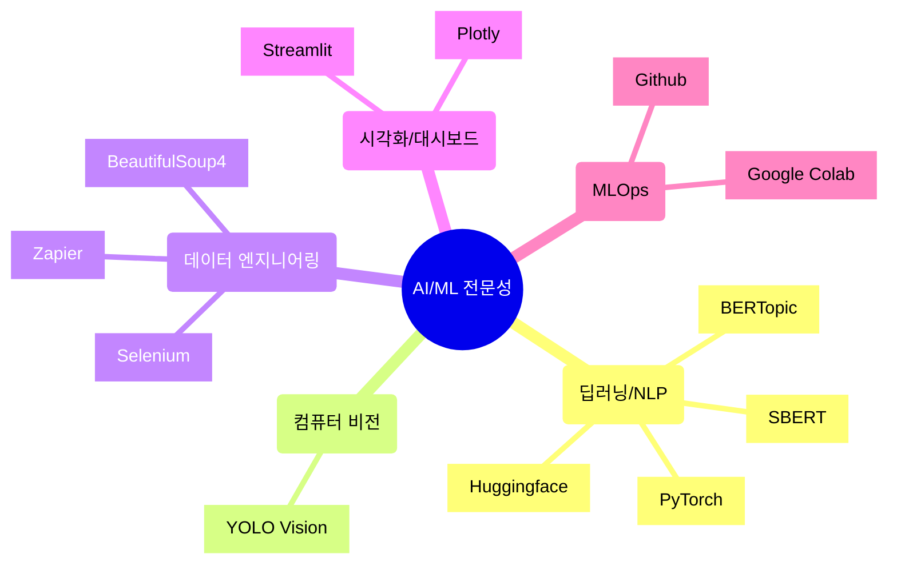

# 기술 스택 종합 문서

## 1. 핵심 역량 요약

### 전문 분야
- NLP/텍스트 분석 전문가
- 언어 모델 최적화 및 파인튜닝 
- 데이터 수집/처리 자동화 시스템 구축

## 2. 프로젝트 포트폴리오

### 2.1 텍스트 임베딩 기반 기술문서 분류 자동화
- **사용 기술**: SBERT, BERTopic, PyTorch
- **주요 성과**:
  - 대규모 기술문서 자동 분류 시스템 구축
  - 임베딩 모델 파인튜닝을 통한 분류 정확도 향상
  - 문서 처리 시간 대폭 단축

### 2.2 특허 청구항 해석 모델 개발
- **사용 기술**: Huggingface Transformers, PyTorch
- **주요 성과**:
  - 특허 문서 특화 언어 모델 개발
  - 청구항 요소별 자동 해석 시스템 구축
  - 특허 분석 프로세스 자동화

### 2.3 Qi certified 제품정보 데이터 수집 시스템
- **사용 기술**: BeautifulSoup4, Selenium, Zapier
- **주요 성과**:
  - 자동화된 데이터 수집 파이프라인 구축
  - 대규모 제품 정보 DB 구축
  - Zapier 기반 워크플로우 자동화

## 3. 기술 역량 상세 분석

### 3.1 프로그래밍 및 프레임워크
- **Python**: 고급
  - 데이터 처리, 모델 개발, 자동화 스크립트 작성
- **PyTorch**: 고급
  - 모델 학습, 파인튜닝, 커스텀 아키텍처 설계
- **Huggingface**: 고급
  - Transformer 모델 활용, 모델 최적화

### 3.2 특화 기술
- **텍스트 분석/NLP**: 
  - SBERT, BERTopic 기반 텍스트 임베딩 및 분류
  - 특허/기술문서 특화 모델 개발
- **데이터 수집/처리**: 
  - 웹 크롤링 자동화
  - 데이터 파이프라인 구축
- **MLOps**: 
  - 모델 배포 및 관리
  - 자동화 워크플로우 구축

## 4. 발전 전략

### 4.1 단기 목표 (6개월)
- AWS/Azure 클라우드 서비스 활용 확대
- Docker/Kubernetes 기반 컨테이너화 학습
- CI/CD 파이프라인 구축 경험 확보

### 4.2 중장기 목표 (1-2년)
- 마이크로서비스 아키텍처 설계 역량 강화
- 분산 시스템 운영 경험 축적
- AI 시스템 확장성 관리 전문성 개발

## 5. 차별화 요소

### 5.1 기술적 차별성
- 특허/기술문서 도메인 특화 NLP 전문성
- 엔드투엔드 자동화 시스템 구축 경험
- MLOps 기반 실무 구현 경험

### 5.2 프로젝트 관리 역량
- 복잡한 데이터 처리 파이프라인 설계/구현
- 자동화 시스템 최적화 및 유지보수
- 실제 비즈니스 문제 해결 경험

---
*이 기술 스택 문서는 현재의 역량과 향후 발전 방향을 포괄적으로 제시하며, 지속적인 업데이트를 통해 최신 기술 트렌드를 반영할 예정입니다.*
